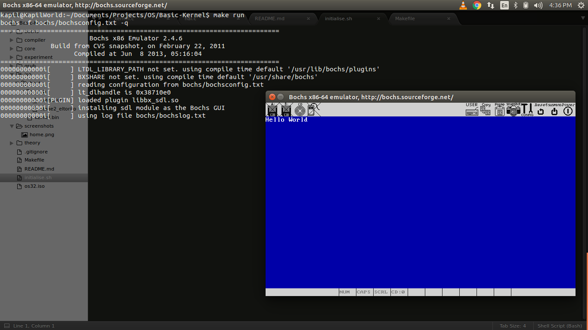

# Basic Hybrid Kernel
> Hybrid Kernel with minimal feature like interrupt handling, command line interface

GNU GRUB(GRand Unified Bootloader) legacy is used as bootloader

## Requirement
* `gcc` cross Compiler [get prebuild binaries here](http://wiki.osdev.org/GCC_Cross-Compiler).

* bochs x86 Emulator for running kernel in virtual environment.
```
[sudo] apt-get install bochs
[sudo] apt-get install bochs-sdl (for GUI support) 
```
* `genisoimage` to generate ISO image of kernel.
```
[sudo] apt-get install genisoimage
```
* `makedepend` for generating dependencies
```
[sudo] apt-get install xutils-dev
```

## Installation
* Clone the repository
```
git clone https://github.com/Kapilks/Basic-Kernel.git
```
* Setup the directory
```
[sudo] make configure
```
* Build `hal` (Hardware Abstraction Layer) library, `stdlib` for C and kernel binaries<br/>
(Can be done separately)
```
[sudo] make all
```
* Generate the bootable iso image of kernel 
```
[sudo] make iso
```
* Run kernel in `bochs`
```
[sudo] make run
```

## Directory Structure of ISO image
- iso
	- boot
		- grub
			- menu.lst
			- stage2_eltorito
		- kernel.bin

## Screenshot
